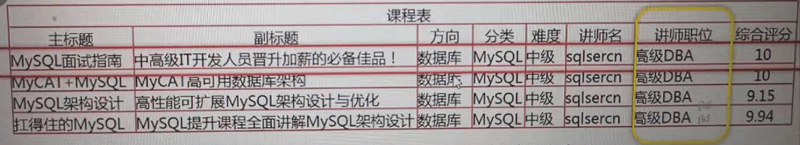
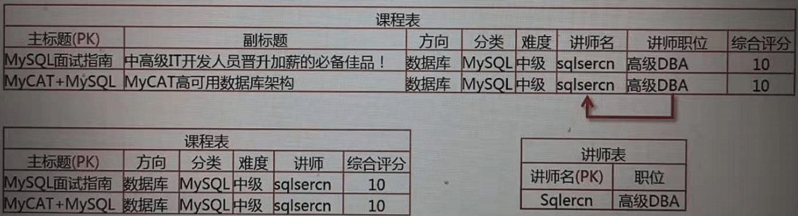

# Mysql_Study

Mysql8.0 学习

## 数据库选型 SQL VS NOSQL

SQL：MySQL，Oracle，SQLServer，PostGreSQL

NOSQL：Hbase，MongoDB，Redis，Hadoop

### 关系型数据库的特点

- 数据结构化存储在二维表中（同时可以存储非结构化的数据JSON）
- 支持事务的原子性```A```，一致性```C```，隔离性```I```，持久性```D```特性
- 支持使用SQL语言对存储在其中的数据进行操作

### 关系型数据库适用的场景

- 数据之间存在着一定的关系，需要关联查询数据的场景
- 需要事务支持的业务场景（保证数据的完整性）
- 需要使用SQL语言灵活操作数据的场景

### 非关系型数据库的特点

- 存储结构灵活，没有固定的结构（一般情况下每条数据需要重复存储对应的字段名，需要更多的存储空间）
- 对事务的支持比较弱，查询写入数据时，不用验证数据的完整性，对数据的并发处理性能高
- 大多不使用SQL操作数据

### 非关系型数据库适用的场景

- 数据结构不固定的场景
- 对事物要求不高，但读写并发要求高的场景（日志监控，用户行为）
- 对数据的处理操作比较简单的场景

### 关系型数据库选型原则

- 数据库使用的广泛性
- 数据库的可扩展性
- 数据库的安全性和稳定性
- 数据库所支持的系统
- 数据库的使用成本

## 数据库结构设计

- 业务分析
- 逻辑设计 根据业务需求进行逻辑设计，影响使用方便性，查询高效性等
- 数据类型 
- 对象命名 
- 建立库表

### 逻辑设计

宽表模式：把一个对象的所有属性全部存在一个表中，对象属性很多，数据库表的列就很多

宽表模式存在的问题：

  - 数据冗余：相同数据在表中出现多次
  - 数据更新异常：修改一行中某列的值时，由于数据冗余，有可能会导致修改多行数据，有可能会导致数据不一致
  

    ```javascript
    //修改多行数据
    UPDATE 课程表 SET 讲师职位='MySQL架构师'
    WHERE 讲师名='sqlsercn';

    //数据不一致
    UPDATE 课程表 SET 讲师职位='MySQL架构师'
    WHERE 讲师名='sqlercn' AND 主标题='MySQL面试指南';
    ```

  - 数据插入异常：部分数据由于缺乏主键信息而无法写入表中
  

    ```javascript
    //当前没有具体的课程 缺乏主键信息 无法写入表中
    INSERT INTO 课程表(方向) VALUES '前端开发';
    ```
  - 数据删除异常：删除某一数据时，不得不删除其他的数据
  

    ```javascript
    //不仅删除了数据库这一项 相关的课程信息也删除了
    DELETE FROM 课程表 WHERE 方向='数据库';
    ```
- 宽表模式的适用场景：
  - 配合列存储的数据报表场景（数据存储在一个表中，查询时不需要关联多个表，sql执行效率相对较高）

数据库设计范式：

- 第一范式：数据表中的每一列（每个字段）必须是不可拆分的最小单元，也就是确保每一列的原子性
  
- 第二范式：表中必须存在业务主键，要求表中的所有列，都必须依赖于主键，而不能有任何一列与主键没有关系，也就是说一个表只描述一件事情
  
  ```javascript
  用户，章节，标题组成复合主键 用户积分只依赖用户，拆分成两个表
  ```

  
- 第三范式：必须先满足第二范式，并且表中的非主键列之间不能相互依赖
 
  ```javascript
  讲师职位依赖于讲师，拆分成两个表
  ```

  

数据库反范式化设计：

按照范式化设计越严格，表就会被分的越细，查询数据时关联的表就越多，查询效率就慢。通过以```空间换时间```，适度增加数据冗余，减少关联表的数量，提高数据查询效率。

### 物理设计

数据库中表的每一列的数据类型如何设计，如何对数据库，表对象进行命名

MySQL支持多种存储引擎，而存储引擎决定了表中数据的存储结构

MySQL常见的存储引擎：


InnoDB存储引擎的特点：

- 事务型存储引擎支持ACID：不要混合使用事务型存储引擎和非事务型存储引擎，如果在一个事务中同时使用了事务型和非事务型存储引擎的表，一旦事务由于某种原因进行了回滚，对于非事务型存储引擎中的数据，所进行的修改是无法回滚的，这样就破坏了事务的一致性要求，同时破坏了数据的完整性
- 逻辑上数据按主键聚集存储：在具有聚集索引主键的存储引擎中，每一个非主键的索引的叶子节点，所指向的都是数据行中的主键，而不是数据行的物理存储位置，因此主键的大小直接影响索引查找数据的性能，另一方面由于数据是按主键的逻辑顺序存储的，如果键的顺序经常无规则的变化，一定会造成数据的迁移，这样也会带来IO性能上的损耗。所以，一般情况下建议使用```自增id```来作为表的主键，同时可以给业务主键建立唯一索引，保证其数据唯一
- 支持行级锁及MVVC：
  - 支持行级锁：在进行数据读写操作时，只会在需要读写的数据行上加锁，大大增强了InnoDB存储引擎，数据的变化处理能力
  - 支持MVVC：多版本并发控制，进一步避免读写操作的互相阻塞 所以InnoDB存储引擎非常适合高并发，读写混合的场景
- 支持Btree和自适应的Hash索引
- 支持全文和空间索引：MySQL5.6以后支持全文索引，MySQL5.7以后支持空间索引

MySQL常见的数据类型：

- 整数类型
  
- 浮点类型，小数类型
  
- 日期，时间类型
  
- 字符串类型
  

如何为数据选择合适的数据类型：

- 优先选择符合存储数据需求的最小数据类型
- 谨慎使用```ENUM```，```TEXT```字符串类型
- 与财务相关的数值型数据，必须使用```DECIMAL```类型

如何为表和列选择适合的名字：

- 所有数据库对象名称，必须使用```小写字母```，每个词语之间建议使用```下划线```分割：MySQL数据库区分大小写
- 所有数据库对象名称定义，禁止使用MySQL```保留关键字```
- 数据库对象的命名最好能做到```见名识义```，并且最好不要超过32个字符
- 可以保留数据库名，方便区分具体的数据库
- 临时表必须以temp为前缀并以日期为后缀，方便区分，清理
- 用于备份的库，表以bak为前缀并以日期为后缀
- 所有表中存储相同数据的列名和列类型必须一致：可以用到关联列的```索引```，使得查询更加高效

## SQL语言开发

### 初识SQL

- 什么是SQL：结构化查询语言，一种描述性语言，面向语义化
- SQL语言的作用：对存储在RDBMS（关系型数据库管理系统）中的数据进行增删改查等操作，有些非关系数据库也支持SQL
- 常见的SQL语言的种类：
  - DCL（Data Control Language）：数据库控制语言
    - 创建用户
    - 设置或更改数据库用户或角色权限的语句，包括（grant,revoke等）语句
  - DDL（Data Definition Language）：数据定义语言
    - 主要的命令有CREATE、ALTER、DROP等，DDL主要是用在定义或改变表（TABLE）的结构，数据类型，表之间的链接和约束等初始化工作上，他们大多在建立表时使用
  - DML（Data Manipulation Language）：数据操作语言
    - SELECT、UPDATE、INSERT、DELETE`，就象它的名字一样，这4条命令是用来对数据库里的数据进行操作的语言
  - TCL(Transaction Control Language)：事务控制语句
    - 用于控制事务，常用的语句关键字有：COMMIT,ROLLBACK,SAVEPOINT,SET TRANSACTION

### 访问控制
 
DCL（Data Control Language）

- 建立数据库账号：CREATE USER
  
  ```javascript
  //访问控制列表：指定用户可以从哪些客户端访问
  CREATE USER 用户名@访问控制列表 IDENTIFIED BY '密码';
  CREATE USER user1@localhost IDENTIFIED BY '123456';
  ```

- 对用户授权：GRANT
  - GRANT命令注意事项
    - 使用GRANT授权的数据库账户必须存在
    - 用户使用GRANT命令授权必须具有grant option的权限 只能授予自己拥有的权限
  
  ```javascript
  //显示权限列表
  SHOW PRIVILEGES;
  //给用户user1授予mysql。user表上user，host列的查询权限
  GRANT SELECT(user,host) ON mysql.`user` TO user1@localhost;
  //给用户user1授予mysql。user表上所有列的查询权限
  GRANT SELECT ON mysql.`user` TO user1@localhost;
  //给用户user1授予mysql库中所有表上所有列的查询权限
  GRANT SELECT ON mysql.* TO user1@localhost;

  ```

- 收回用户权限：REVOKE
  
  ```javascript
  //收回用户user1对mysql库中所有表上所有列的删除，修改，插入权限
  GRANT DELETE,UPDATE,INSERT ON mysql.* TO user1@localhost;

  ```

### 创建数据库对象

DDL（Data Definition Language）

- 建立/修改/删除数据库：create/alter/drap database
- 建立/修改/删除表：create/alter/drap table
  
  ```javascript
  //创建学生表
  CREATE TABLE `student` (
    `id`  int(11) NOT NULL PRIMARY KEY AUTO_INCREMENT   ,
    `name`  varchar(50) NOT NULL ,
    `age`  int(11) NULL DEFAULT NULL ,
    `city`  varchar(50) DEFAULT '北京' ,
  );
  //显示表结构
  SHOW CREATE TABLE student;

  //增加身份证号字段
  ALTER TABLE `student` ADD COLUMN `idcard`  varchar(15) NULL AFTER `city`; --增加身份证字段
  ALTER TABLE `student` MODIFY COLUMN `idcard`  varchar(18) DEFAULT NULL AFTER `name`; --修改身份证字段
  ALTER TABLE `student`DROP COLUMN `idcard`; --删除身份证字段

  //添加约束
  -- 主键约束
  ALTER TABLE `student` ADD PRIMARY KEY (`id`);
  -- 唯一约束
  ALTER TABLE `student` ADD UNIQUE INDEX `uq_idcard` (`idcard`) ;
  -- 默认约束
  ALTER TABLE `student` MODIFY COLUMN `city`  varchar(50)  DEFAULT '北京' AFTER `age`;
  -- 外键约束
  ALTER TABLE `score` ADD CONSTRAINT `fk_stuid` FOREIGN KEY (`student_id`) REFERENCES `student` (`id`);
  -- 删除约束
  ALTER TABLE `score` DROP FOREIGN KEY `fk_stuid`;
  ```

- 建立/删除索引：create/drap index
  
  ```javascript
  //创建唯一索引
  CREATE UNIQUE INDEX uq_idcard ON student(idcard)
  ```

- 截断表：truncate table 数据全部清空,但表结构、列、约束等不被改动 不能用于有外键约束引用的表 标识列重新开始编号 因为要删除的数据不会写入日志，数据也不能恢复，所以工作中请尽量不要使用此命令
- 重命名表：rename table
- 建立/修改/删除视图：create/alter/drap view 简化查询

### 操作表

- DML（Data Manipulation Language）
- INSERT
- DELETE
- UPDATE
- SELECT

DML（Data Manipulation Language）

- 新增表中的数据：
  - INSERT  [INTO]  表名  [(列名)] VALUES  (值列表)
- 删除表中的数据：
  - DELETE [FROM]  表名 [WHERE <删除条件>]
- 修改表中的数据： 
  - UPDATE 表名 SET 列名 = 更新值 [WHERE 更新条件]
- 查询表中的数据：
  - SELECT    <列名> FROM      <表名> [WHERE    <查询条件表达式>] [ORDER BY <排序的列名>[ASC或DESC]]

编写INSERT语句的思路：

- 确定要把数据插入到哪个表中
- 确认表的数据库结构，哪些列不为为NULL，哪些列可以为NULL，对于不能为NULL的列是否有默认值
- 确定对应插入列插入值的清单

编写DELETE语句的思路：

- FROM子句：确定要删除的数据存储在哪个表中
- WHERE子句：确定删除数据的过滤条件
- ORDER BY...LIMIT子句：确定是否只删除有限条数据

编写UPDATE语句的思路：

- UPDATE子句：确定要更新的数据存储在哪个表中
- SET子句：确定需要修改的列名，以及列值
- WHERE子句：确定更新数据的条件

编写SELECT语句的思路：

- FROM子句：首先确定需要获取的数据存在哪些表中
- SELECT子句：其次确定需要获取表中的哪些列
- WHERE子句：确定是否需要对表中的数据进行过滤

SELECT 的执行顺序

- 关键字的顺序是不能颠倒的：
  
  ```javascript
  SELECT ... FROM ... WHERE ... GROUP BY ... HAVING ... ORDER BY ...
  ```

- SELECT 语句的执行顺序（在 MySQL 和 Oracle 中，SELECT 执行顺序基本相同）：
  
  ```javascript
  FROM > WHERE > GROUP BY > HAVING > SELECT 的字段 > DISTINCT > ORDER BY > LIMIT
  ```

SELECT 检索数据


如何从多个表中获取数据？

- 表与表之间要存在一定的关联关系
- 使用JOIN关联多个表
  - INNER JOIN 内连接：查询左表和右表中符合条件的数据
  - LEFT JOIN 左外连接：查询左表的全部和右表符合条件的数据
  - RIGHT JOIN 右外连接：查询右表的全部和左表符合条件的数据
  - ON 连接条件


GROUP BY ... HAVING 子句的作用：

- 把结果集按某些列分成不同额组，并对分组后的数据进行聚合操作
- SELECT列表中只能包含：
  - 被分组的列
  - 为每个分组返回一个值的表达式，如```聚合函数```
  - MySQL在宽松的sql模式下，可以查询未被分组的列，但是必须在被分组的列之后，并且可能查询的数据并不正确
  
    ```javascript
    //获取sql_mode
    SHOW VARIABLES like 'sql_mode';
    select @@sql_mode;
    ```

- HAVING：用于过滤分组后的记录

使用ORDER BY子句对查询的结果进行排序

- 使用ORDER BY子句是对查询的结果进行排序的最安全方式
- 列名后加ASC代表升序，DESC代表降序
- ORDER BY子句也可以使用SELECT子句中未出现的列或函数

使用LIMIT子句限制返回结果集的行数

- 常用于数据列表分页
- 一定要与ORDER BY子句配合使用
- LIMIT 起始偏移量，结果集的行数

### SQL运算符

是一种符号，它是用来进行列间或者变量之间的比较和数学运算的

- 比较运算符
- 逻辑运算符
- 算术运算符

比较运算符：

|   比较运算符         | 说明                | 
| ------------------- | ------------------- | 
|      =              | 等于                |
|      >              | 大于                |
|      <              | 小于                |
|      <>             | 不等于              |
|      >=             | 大于等于            | 
|      <=             | 小于等于            |
|      !=             | 不等于              |
|BETWEEN min AND max  |列的值大于等于max，小于等于min|
|IS NULL，IS NOT NULL | 判断列的值是否为NULL |
|     LIKE，NOT LIKE  | ```%```代表任意数量的字符，```_```代表任何一个字符 |
|      IN，NOT IN      | 判断列的值是否在指定范围内 |

逻辑运算符：

|   逻辑运算符         | 说明                |
| ------------------- | ------------------- |
|      AND，&&        | 当且仅当两个布尔表达式都为true时，返回true |
|      OR，||         | 当且仅当两个布尔表达式都为false，返回false |
|      XOR            | 当且仅当两个布尔表达式一真一假时返回true，否则返回false|
|      NOT            | 布尔表达式的值取反     |

```注意：任何运算符与NULL值运算结果都是NULL```

算术运算符：

|   算术运算符         | 说明                |
| ------------------- | ------------------- |
|      +              | 加法运算，求两个数或表达式相加的和 |
|      -              | 减法运算，求两个数或表达式相减的差 |
|      *              | 乘法运算，求两个数或表达式相乘的积 |
|      /              | 除法运算，求两个数或表达式相除的商 |
|      %              | 取模运算，求两个数或表达式相除的余数 |

### MySQL 常见聚合函数

对一组值进行计算，并返回计算后的值，一般用来统计数据

|   聚合函数           | 说明                |
| ------------------- | ------------------- |
|   COUNT(*)/COUNT(col) | 计算符合条件的数据行数 |
|   MAX(col_name)      | 最大值              |
|   MIN (col_name)     | 最小值              |
|   SUM (col_name)     | 求和                |
|   AVG(col_name)      | 平均值              |

### 系统函数

- 时间函数
- 字符串函数
- 数学函数
- CASE函数

常见的时间函数

|   时间函数           | 说明                    |
| ------------------- | ------------------------|
| CURDATE()/CURTIME() | 返回当前日期/返回当前时间 |
| NOW()               | 返回当前日期和时间        |
| DATE_FORMAT(date,format) | 按照format格式，对日期date进行格式化 |
| SEC_TO_TIME(seconds) | 把秒数转换为(小时：分：秒) |
| TIME_TO_SEC(time)    | 把时间(小时：分：秒)转换为秒数 |
| DATEDIFF(date1,date2) | 返回date1和date2两个日期相差的天数 date1-date2 |
| DATE_ADD(date,INTERVAL expr unit) | 对给定的日期增加或减少指定的时间单元 |
| EXTRACT(unit FROM date) | 返回日期date的指定部分 |
| TRIM([remstr FROM] str) | 从字符串str两端删除字符串remstr |
| LOWER(str)            | 转小写字母              |
| UPPER(str)            | 转大写字母              |

```javascript
//获取当前日期，时间，当前日期和时间  
SELECT CURDATE(),CURTIME(),NOW();

//格式化时间
SELECT DATE_FORMAT(NOW(),'%Y年%m月%d日');

//把时间(小时：分：秒)转换为秒数
SELECT TIME_TO_SEC(CURTIME());

//获取相差的天数 
SELECT DATEDIFF('2019-1-1',NOW());

SELECT NOW()
      ,DATE_ADD(NOW(),INTERVAL 1 DAY) -- 当前时间加1天
      ,DATE_ADD(NOW(),INTERVAL 1 YEAR) -- 当前时间加1年
      ,DATE_ADD(NOW(),INTERVAL -1 DAY) -- 当前时间减1天
      ,DATE_ADD(NOW(),INTERVAL '-1:30' HOUR_MINUTE); -- 当前时间减1小时30分钟

SELECT NOW()
      ,EXTRACT(YEAR FROM NOW()) -- 提取当前时间的年份
      ,EXTRACT(MONTH FROM NOW()) -- 提取当前时间的年份
      ,EXTRACT(DAY FROM NOW()); -- 提取当前时间的日期
```

常见的字符串函数

|   字符串函数           | 说明                    |
| --------------------- | ------------------------|
| CONCAT(str1,str2,...) | 把字符串str1,str2连接成一个字符串 |
| CONCAT_WS(separator,str1,str2,...) | 使用指定的分隔符进行字符连接 |
| CHAR_LENGTH(str)      | 返回字符串str的字符个数   |
| LENGTH(str)           | 返回字符串str的字节个数   |
| FORMAT                | 数字格式化,如'#,###,###'  |
| LEFT(str,len)/RIGHT(str,len) | 从字符串str左/右截取指定长度的字符串 |
| SUBSTRING(str,pos,len) | 从字符串str pos位置起截取长度为len的字符串 第一个位置为：1 |
| SUBSTRING_INDEX(str,delim,count) | 返回字符串str按delim分割的前count个字符串 |
| LOCATE(substr,str)     | 返回字符串str中substr子串出现的位置 |
| MD5(str)               | 返回str的MD5值|

```javascript
SELECT CONCAT('hello','world'); -- 'helloworld'

SELECT CONCAT_WS('-','hello','world'); -- 'hello-world'

SELECT CHAR_LENGTH('你好'); --2

SELECT LENGTH('你好'); -- 6

//数字格式化
SELECT FORMAT(100000,2); -- 100,000.00
SELECT FORMAT(100.31111,2); -- 100.31
SELECT FORMAT(100.31111,0); 100
SELECT FORMAT(423423234.65534453,2); -- 423,423,234.66

SELECT LEFT('hello',2); -- 'he'

SELECT RIGHT('hello',2); -- 'lo'

SELECT SUBSTRING('hello',1,3); -- 'hel'

SELECT SUBSTRING_INDEX('192.168.0.211','.',2); -- '192.168'

SELECT SUBSTRING_INDEX('192.168.0.211','.',-2); -- '0.211'

SELECT LOCATE('he','hello'); -- 1

SELECT TRIM('  hello  '); -- 'hello'
SELECT LTRIM('  hello  '); -- 'hello  '
SELECT RTRIM('  hello  '); -- '  hello'
SELECT TRIM('x' FROM 'xxxhelloxx'); -- 'hello'
```

常见的数学函数

|     数学函数           |        说明            |
| --------------------- | -----------------------|
|     ROUND(X,D)        | 对数字X进行四舍五入保留D位小数 |
|     RAND()            | 生成0-1之间的随机数      |
|     CEIL(X)           | 向上取整                |
|     FLOOR(X)          | 向下取整                |

```javascript

SELECT ROUND(111/2,3); -- 55.500
//生成0-1之间的随机数
SELECT RAND();

SELECT CEIL(55.1); -- 56

SELECT FLOOR(55.9); -- 55
```

CASE函数

用于实现其他语言中的case...when功能，提供数据流控制

```javascript
CASE 要判断的字段和表达式
WHEN 常量1 then 要显示的值或语句1
WHEN 常量2 then 要显示的值或语句2
ELSE 要显示的值
END
```

### 子查询

- 子查询就是指出现在其它SQL语句中的SELECT语句,必须始终出现在圆括号中
- 子查询可以包含多个关键字或条件
- 子查询的外层查询可以是: SELECT、INSERT、UPDATE、SET等
- 子查询可以返回常量、一行数据、一列数据或其它子查询

### SQL高级特性

- 公用表表达式CTE(Common Table Expressions)
- 窗口函数

公用表表达式CTE(Common Table Expressions)

- MySQL8.0之后的版本才可以使用
- CTE生成一个命名临时表，并且只在查询期间有效
- CTE临时表在一个查询中可以多次引用及自引用(递归查询)
- 性能，可读性都优于子查询

CTE基本语法：

```javascript
//RECURSIVE：可选关键字 如果指定了RECURSIVE关键字，则说明CTE是一个可以自引用的临时表，通常用于递归查询的场景
//cte_name：临时表表名
//column_list：可选列列表 必须与query查询结果中的列一一对应
//AS：定义生成CTE的查询
//query：SELECT查询语句，查询结构就是CTE临时表中的数据
WITH [RECURSIVE]
cte_name[(column_list)] AS (
   query
),
cte_name2[(column_list)] AS (
  query
)

SELECT * FROM cte_name

// CTE递归生成序列
WITH RECURSIVE test AS(
    SELECT 1 AS n
    UNION ALL
    SELECT 1+n FROM test WHERE n<10
)

SELECT * FROM test
```

窗口函数

- 窗口：一组记录，窗口函数：这组记录所执行的函数，符合条件的每一条记录都会分别执行窗口函数
- 窗口函数可以进行排序，生成序列号等一般的聚合函数无法实现的高级操作。
- 窗口函数也称为OLAP函数，意思是对数据库数据进行实时分析处理。窗口函数就是为了实现OLAP而添加的标准SQL功能。

窗口函数基本语法：

```javascript
<窗口函数> over (
  [partition by <列清单>]
  order by <排序用列清单>)
```

窗口函数

|     函数名        |        说明            |
| -----------------| -----------------------|
|     聚合函数      | 聚合函数都可以作为窗口函数使用 |
|     ROW_NUMBER() |返回窗口分区类数据的行数      |
|     RANK()       | 类似于ROW_NUMBER，只是对相同数据会产生重复的行号，之后的数据行号会产生间隔|
|     DENSE_RANK() | 类似于RANK区别在于当组内某行数据重复时，虽然行号会重复，但后续的行号不会产生间隔 |


### 在SQL开发中易犯的错误

- 使用COUNT(*)判断是否存在符合条件的数据：
  - InnoDB引擎中，COUNT操作，每次查询都会扫描所有符合条件的的数据后，才会返回结果
  - 解决方法：SELECT...LIMIT 1，找到一条数据，直接返回结果，提高查询效率
- 在执行一个更新语句后，使用查询方式判断更新语句是否执行成功
  - 解决方法：在UPDATE，DELETE语句后，使用ROW_COUNT()函数判断修改行数
- 视图在ON条件中过滤不满足条件的数据
  - 解决方法：在WHERE条件中进行过滤
- 在使用IN进行子查询的判断时，在列中未指定正确的表面。如SELECT A1 FROM A WHERE A1 IN (SELECT A1 FROM B)，这时尽管B中并不存在A1列，数据库也不会报错，而是会列出A表中所有数据
  - 解决方法：使用JOIN关联代替子查询
- 在表中定义的具有NOT NULL和DEFAULT值的列，在插入数据时直接插入NULL值
  - 解决方法： 避免插入NULL