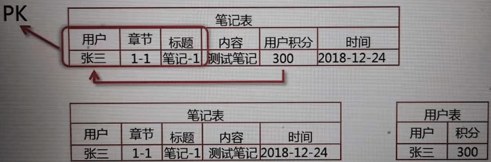
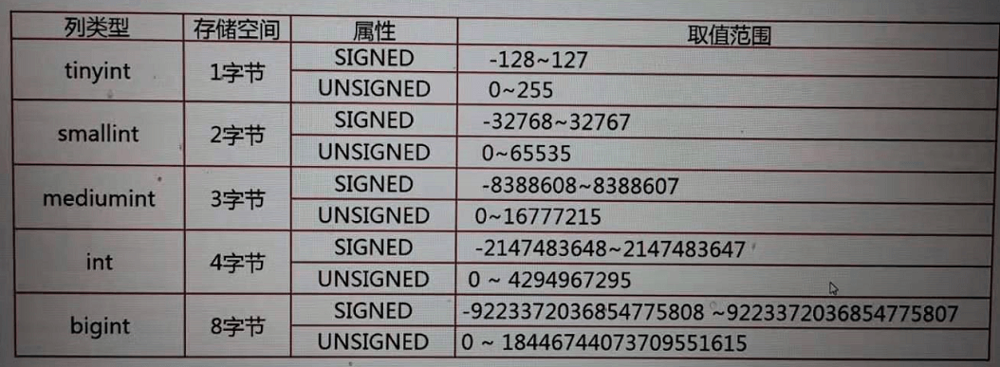

# Mysql_Study

Mysql 学习

## 数据库选型 SQL VS NOSQL

SQL：MySQL，Oracle，SQLServer，PostGreSQL

NOSQL：Hbase，MongoDB，Redis，Hadoop

### 关系型数据库的特点

- 数据结构化存储在二维表中（同时可以存储非结构化的数据JSON）
- 支持事务的原子性```A```，一致性```C```，隔离性```I```，持久性```D```特性
- 支持使用SQL语言对存储在其中的数据进行操作

### 关系型数据库适用的场景

- 数据之间存在着一定的关系，需要关联查询数据的场景
- 需要事务支持的业务场景（保证数据的完整性）
- 需要使用SQL语言灵活操作数据的场景

### 非关系型数据库的特点

- 存储结构灵活，没有固定的结构（一般情况下每条数据需要重复存储对应的字段名，需要更多的存储空间）
- 对事务的支持比较弱，查询写入数据时，不用验证数据的完整性，对数据的并发处理性能高
- 大多不使用SQL操作数据

### 非关系型数据库适用的场景

- 数据结构不固定的场景
- 对事物要求不高，但读写并发要求高的场景（日志监控，用户行为）
- 对数据的处理操作比较简单的场景

### 关系型数据库选型原则

- 数据库使用的广泛性
- 数据库的可扩展性
- 数据库的安全性和稳定性
- 数据库所支持的系统
- 数据库的使用成本

## 数据库结构设计

- 业务分析
- 逻辑设计 根据业务需求进行逻辑设计，影响使用方便性，查询高效性等
- 数据类型 
- 对象命名 
- 建立库表

### 逻辑设计

宽表模式：把一个对象的所有属性全部存在一个表中，对象属性很多，数据库表的列就很多

宽表模式存在的问题：

  - 数据冗余：相同数据在表中出现多次
  - 数据更新异常：修改一行中某列的值时，由于数据冗余，有可能会导致修改多行数据，有可能会导致数据不一致
  

    ```javascript
    //修改多行数据
    UPDATE 课程表 SET 讲师职位='MySQL架构师' 
    WHERE 讲师名='sqlsercn'

    //数据不一致
    UPDATE 课程表 SET 讲师职位='MySQL架构师' 
    WHERE 讲师名='sqlercn' AND 主标题='MySQL面试指南'
    ```

  - 数据插入异常：部分数据由于缺乏主键信息而无法写入表中
  

    ```javascript
    //当前没有具体的课程 缺乏主键信息 无法写入表中
    INSERT INTO 课程表(方向) VALUES '前端开发'
    ```
  - 数据删除异常：删除某一数据时，不得不删除其他的数据
  

    ```javascript
    //不仅删除了数据库这一项 相关的课程信息也删除了
    DELETE FROM 课程表 WHERE 方向='数据库'
    ```
- 宽表模式的适用场景：
  - 配合列存储的数据报表场景（数据存储在一个表中，查询时不需要关联多个表，sql执行效率相对较高）

数据库设计范式：

- 第一范式：数据表中的每一列（每个字段）必须是不可拆分的最小单元，也就是确保每一列的原子性
  
- 第二范式：表中必须存在业务主键，要求表中的所有列，都必须依赖于主键，而不能有任何一列与主键没有关系，也就是说一个表只描述一件事情
  
  ```javascript
  用户，章节，标题组成复合主键 用户积分只依赖用户，拆分成两个表
  ```

  
- 第三范式：必须先满足第二范式，并且表中的非主键列之间不能相互依赖
 
  ```javascript
  讲师职位依赖于讲师，拆分成两个表
  ```

  

数据库反范式化设计：

按照范式化设计越严格，表就会被分的越细，查询数据时关联的表就越多，查询效率就慢。通过以```空间换时间```，适度增加数据冗余，减少关联表的数量，提高数据查询效率。

### 物理设计

数据库中表的每一列的数据类型如何设计，如何对数据库，表对象进行命名

MySQL支持多种存储引擎，而存储引擎决定了表中数据的存储结构

MySQL常见的存储引擎：


InnoDB存储引擎的特点：

- 事务型存储引擎支持ACID：不要混合使用事务型存储引擎和非事务型存储引擎，如果在一个事务中同时使用了事务型和非事务型存储引擎的表，一旦事务由于某种原因进行了回滚，对于非事务型存储引擎中的数据，所进行的修改是无法回滚的，这样就破坏了事务的一致性要求，同时破坏了数据的完整性
- 逻辑上数据按主键聚集存储：在具有聚集索引主键的存储引擎中，每一个非主键的索引的叶子节点，所指向的都是数据行中的主键，而不是数据行的物理存储位置，因此主键的大小直接影响索引查找数据的性能，另一方面由于数据是按主键的逻辑顺序存储的，如果键的顺序经常无规则的变化，一定会造成数据的迁移，这样也会带来IO性能上的损耗。所以，一般情况下建议使用```自增id```来作为表的主键，同时可以给业务主键建立唯一索引，保证其数据唯一
- 支持行级锁及MVVC：
  - 支持行级锁：在进行数据读写操作时，只会在需要读写的数据行上加锁，大大增强了InnoDB存储引擎，数据的变化处理能力
  - 支持MVVC：多版本并发控制，进一步避免读写操作的互相阻塞 所以InnoDB存储引擎非常适合高并发，读写混合的场景
- 支持Btree和自适应的Hash索引
- 支持全文和空间索引：MySQL5.6以后支持全文索引，MySQL5.7以后支持空间索引

MySQL常见的数据类型：

- 整数类型
  
- 浮点类型，小数类型
  
- 日期，时间类型
  
- 字符串类型
  

如何为数据选择合适的数据类型：

- 优先选择符合存储数据需求的最小数据类型
- 谨慎使用```ENUM```，```TEXT```字符串类型
- 与财务相关的数值型数据，必须使用```DECIMAL```类型

如何为表和列选择适合的名字：

- 所有数据库对象名称，必须使用```小写字母```，每个词语之间建议使用```下划线```分割：MySQL数据库区分大小写
- 所有数据库对象名称定义，禁止使用MySQL```保留关键字```
- 数据库对象的命名最好能做到```见名识义```，并且最好不要超过32个字符
- 可以保留数据库名，方便区分具体的数据库
- 临时表必须以temp为前缀并以日期为后缀，方便区分，清理
- 用于备份的库，表以bak为前缀并以日期为后缀
- 所有表中存储相同数据的列名和列类型必须一致：可以用到关联列的```索引```，使得查询更加高效
