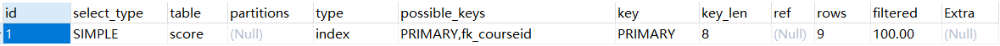

# MySQL数据库优化

## 数据库优化的目的

### 避免出现页面访问错误

- 由于数据库连接timeout产生页面5xx错误
- 由于慢查询导致页面无法加载
- 由于阻塞导致数据无法提交

### 增加数据库稳定性

- 很多数据库的问题都是由低效的查询导致的

### 优化用户体验

- 页面流畅的访问速度
- 良好的网站功能体验

## 数据库优化的几个方面

- 硬件
- 系统配置
- 数据库表结构
- SQL及索引

## SQL优化的一般步骤

- 1.发现问题：发现存在性能问题的SQL
- 2.分析SQL的执行计划：数据库服务器处理具体SQL的方式
- 3.优化索引：通过分析SQL的执行计划，可以知道SQL的执行是否正确使用索引，未正确使用索引，优化索引
- 4.改写SQL：单纯的索引优化并不能解决性能问题，考虑改写SQL，优化SQL语句
- 5.数据库垂直切分：数据量达到一定级别，优化索引，改写SQL达不到优化效果的情况下，采用数据库垂直切分，数据库水平切分
- 6.数据库水平切分

```优化索引```，```改写SQL```是最常用的优化手段

## 发现问题

### 常见发现问题的渠道

- 用户主动上报应用性能问题：上线，开发，测试阶段根据用户反馈页面相应速度，排查相应的SQL性能问题，针对性强，但是比较被动
- 分析慢查询日志发现存在问题的SQL：指定一个阈值，超过阈值的查询都会记录到慢查询日志中，分析日志，发现存在问题的SQL，进行优化
  - 慢查询日志：MySQL提供的在MySQL服务器上执行成功的，并且符合一定条件的记录下来的日志
- 数据库实时监控长时间运行的SQL：数据库压力突增，慢查询可能存在延迟，需要实时监控运行的SQL

### 配置MySQL慢查询日志

- SET GLOBAL slow_query_log = ON
- SET GLOBAL slow_query_log_file = '\sql_log\slowlog.log'
- SET GLOBAL long_query_time = xx.xxxxxx秒
- SET GLOBAL log_queries_not_using_indexes = ON;

```javascript
//开启慢查询日志
SET GLOBAL slow_query_log = ON;

//获取'slow_query_log_file'慢查询日志记录位置 F:\wamp\www\personal_project\software\mysql\mysql-8.0.16-winx64\Data\DESKTOP-C16P34B-slow.log
show variables like 'slow_query_log_file';

//设置慢查询日志记录位置
SET GLOBAL slow_query_log_file = '\sql_log\slowlog.log';

//获取'long_query_time'获取时间阈值 操作阈值会记录到慢查询日志
show variables like 'long_query_time';
SET GLOBAL long_query_time = 0.01;

//获取'log_queries_not_using_indexes' 默认OFF  ON：所有未使用索引的SQL都会记录到慢查询日志
show variables like 'log_queries_not_using_indexes';
SET GLOBAL log_queries_not_using_indexes = ON;
```

### MySQL慢查询日志存储格式

```javascript
//执行SQL的时间
# Time: 2019-08-16T07:51:44.529544Z
//执行SQL的主机信息
# User@Host: root[root] @ localhost [::1]  Id:     9
//SQL的执行信息 Query_time：查询时间，Lock_time：锁定时间，Rows_sent：发送的行数，Rows_examined：扫描的行数
# Query_time: 0.061148  Lock_time: 0.001538 Rows_sent: 5  Rows_examined: 18
//执行SQL的时间
SET timestamp=1565941904;
//SQL的执行内容
SELECT * from score WHERE grade > (SELECT AVG(grade) FROM score);
```

### 分析MySQL慢查询日志

- mysqldumpslow[OPTS...][LOGS...]
  
  ```javascript
  mysqldumpslow slowlog.log
  ```

- pt-query-digest[OPTIONS][FILES][DSN]

  ```javascript
  pt-query-digest slowlog.log
  ```

### 如何通过慢查询日志发现有问题的SQL

- 查询次数多且每次查询占用时间长的SQL
  - 通常为为pt-query-digest分析的前几个查询
- IO大的SQL
  - 注意pt-query-digest分析中的Rows_examined项
- 未命中的索引的SQL
  - 注意pt-query-digest分析中的Rows_sent与Rows_examined的对比，如果Rows_examined远远大于Rows_sent，说明SQL索引命中率不高

### 实时监控长时间运行的SQL

```javascript
//information_schema.`PROCESSLIST`视图记录了所有正在执行的SQL语句的信息 根据TIME过滤长时间运行的SQL
SELECT * 
FROM information_schema.`PROCESSLIST`
WHERE TIME > 60
```

## 分析SQL的执行计划

### 我们呢为什么要关注执行计划？

- 了解SQL如何访问表中的数据：全表扫描，索引扫描，索引查找不同的方式查找数据，对SQL的执行效率有很大的影响
- 了解SQL如何使用表中的索引：是否使用正确索引对性能会产生很大影响
- 了解SQL所使用的查询类型

### 如何获取执行计划

```javascript
//explainable_stmt：需要分析执行计划的SQL语句 在MySQL5.6之前只支持对SELECT语句分析执行计划
//FOR CONNECTION connection_id：在MySQL8.0中除了可以分析静态的SQL，还可以使用FOR CONNECTION connection_id分析正在执行的SQL，connection_id对应于上面PROCESSLIST表中查询出来的正在执行的SQL的连接的ID
EXPLAIN 
{explainable_stmt | FOR CONNECTION connection_id}

explainable_stmt:{
     INSERT stetement
   | DELETE stetement
   | UPDATE stetement
   | SELECT stetement
   | REPLACE stetement
}
```

### 分析执行计划内容



- ID：有两种值，数字序列，NULL：UNION产生的结果集
  - ID表示查询执行的顺序
  - ID相同时，从上到下执行
  - ID不相同时，从大到小执行
- SELECT_TYPE
  - SIMPLE：简单查询，查询中不包含子查询或者UNION操作的查询
  - PRIMARY：查询中若包含任何子查询，则最外层的查询被标记为PRIMARY（主查询）
  - SUBQUERY：子查询中的第一个SELECT，结果不依赖于外部查询
  - DEPENDENT SUBQUERY：子查询中的第一个SELECT，依赖于外部查询
  - UNION：UNION中的第二个或后面的SELECT语句
  - DEPENDENT UNION：UNION中的第二个或后面的SELECT语句，取决于外面的查询
  - UNION RESULT：UNION产生的结果集
  - DERIVED：出现在FROM子句中的子查询
- TABLE
  - 指明是从哪个表中获取数据
    - ```<unionM,N>```：代表由id为M，N的查询，union之后产生的结果集
    - ```<derived N>/<subquery N>```：代表由id为N的查询，产生的结果
- PARTITIONS
  - 对于分区表，显示查询的分区ID
  - 对于非分区表，显示NULL
- TYPE：对表访问方式，表示MySQL在表中找到所需行的方式，又称“访问类型”。常用的类型有： ALL、index、range、 ref、eq_ref、const、system、NULL（从左到右，性能从差到好）
  - NULL：当表的列为空时，MySQL在优化阶段就能够得到结果，不用访问表或者索引
  - system：const联接类型的一个特例，当查询的表只有一行数据
  - const：表中有且只有一条数据匹配查询的条件，如对主键或是唯一索引的查询，这是效率最高的联接方式
  - eq_ref：类似ref，区别在于使用的索引是唯一索引，对于每个索引键值，表中只有一条记录匹配，一般出现在多表连接时使用primary key或者unique index作为关联条件
  - ref：非唯一索引查找，返回所有匹配某个索引关键字的行
  - ref_of_null：类似ref，但是增加了对NULL值列的查询
  - index_merge：该联接类型表示使用了索引合并优化
  - range：索引范围扫描，常用于<、<=、>、>=、between等操作
  - index：索引全扫描，MySQL遍历整个索引来查询匹配行，并不会扫描表，一般是查询的字段都有索引的查询语句
  - ALL：全表扫描，MySQL遍历全表来找到匹配行，一般是没有where条件或者where条件没有使用索引的查询语句
- possible_keys: 查询时可能使用的索引
- key: 查询时实际使用的索引
- key_len: 实际使用索引的最大长度
- ref: 指出哪些列或常量是通过索引查找，过滤的
- rows：根据统计信息预估的需要扫描的行数 
- filtered: 预估的满足条件的数据集占其需要扫描的行数的百分比
- Extra: 执行情况的说明和描述，包含不适合在其他列中显示但是对执行计划非常重要的额外信息
  - Distinct：去重操作，在找到第一个匹配的数据后就会停止查找同样的值
  - NOT EXISTS：使用NOT EXISTS优化查询
  - ```Using filesort```：看到这个的时候，查询就需要进行优化了，MySQL会对数据使用一个外部的索引排序，而不是按照表内的索引顺序进行读取。MySQL中无法利用索引完成的排序操作称为“文件排序”，通常会出现在order by或group by查询中
  - Using index：使用了覆盖索引（Covering Index），查询所需要的所有信息可以通过索引获取，避免访问表中的数据行
  - ```Using temporary```：看到这个的时候，查询就需要进行优化了，使用临时表缓存数据来处理查询，常用于排序，子查询，分组查询
  - Using where：MySQL服务器层获取到的数据需要使用where条件来进行过滤
  - select tables optimized away：直接通过索引获取数据，不用访问表

## SQL优化的手段

使用执行计划提供的信息，优化SQL

- 优化SQL查询所涉及到的表中的索引：使SQL可以更好的利用索引来获取所需要的数据，而不用扫描表
- 改写SQL以达到更好的利用索引的目的

## 索引优化

MySQL的索引是在存储引擎层实现的，而不是在服务层实现的，这就决定了不同的存储引擎在工作方式上可能是不同的，同时不是所有的存储引擎都支持所有类型的索引，同一类型索引在不同的存储引擎中，底层实现也是不同的

### 索引的作用是什么

- 告诉存储引擎如何快速的查找到所需要的数据
- 减少嵌套循环查询的次数，增加过滤的百分比

### InnoDB支持的索引类型

- Btree索引：最常用，默认
- 自适应HASH索引： InnoDB存储引擎为了优化查询性能，而自动建立的，不需要手动管理
- 全文索引：适用于搜索引擎，字符串类型的数据列，但是对中文支持不太好，如果需要使用全文索引，最好使用搜索引擎类的服务代替
- 空间索引：适用于点，线，面空间数据类型上

### Btree索引的特点

- 以B+树的结构存储索引数据
- 适用于全值匹配的查询中，对数据进行过滤
- Btree索引是按照索引键的顺序排列的，适合处理范围查找
- Btree索引从索引的最左侧列开始匹配查找列

### 应该在什么列上建立索引

- 区分度，可筛选性太差的字段不适合单独创建索引
  - 区分度：获取当前字段所有的唯一值，把唯一值和总的行数对比，比值越大，区分度越高
- WHERE子句中的列
- 包含在ORDER BY，GROUP BY，DISTINCT中的字段
  - 在ORDER BY，GROUP BY字段上建立的索引会提高排序性能，避免排序过程中使用临时表
  - MySQL中ORDER BY使用索引条件：
    - 索引列的顺序和ORDER BY子句的顺序完全一致
    - 索引中列的方向和ORDER BY子句中列的方向（升序，降序）完全一致
    - 在多个表的关联查询中ORDER BY中的字段要全部在关联表的第一张表中
- 多表关联查询（JOIN），关联列

### 如何选择复合索引键的顺序

- 可筛选性，区分度最高的列放在联合索引列的最左侧
  - Btree索引从最左侧列开始过滤数据，第一个键值的区分度越高，所能过滤的数据越多，后面处理数据的性能也会越好
- 各个列区分度差不多的情况下，使用最频繁的列放在联合索引列的最左侧，可以提高索引的利用率
- 区分度，使用频繁度条件差不多的情况下，尽量把字段长度小的列放在联合索引列的最左侧
  - 对于InnoDB，一页的默认大小是16K，键值的长度越小，一页所能记录的键值越多，能优化SQL的IO性能

### Btree索引的限制

会导致无法使用索引

- 只能从最左侧开始按索引键的顺序使用索引，不能跳过索引键
- NOT IN 和<>操作无法使用索引
- 索引列上不能使用表达式或函数

### 索引使用的误区

- 索引越多越好
  - 一方面，索引虽说一定程序上可以提高查询效率，但是同样会影响插入，更新数据的效率。另一方面，甚至在一些情况下，索引会降低查询效率，这是因为MySQL优化器在选择如何优化查询时，会根据统计信息，对每一个可以用到的索引，来进行评估，以生成一个最优的执行计划，而如果有很多索引都可以用于查询，这就会影响MySQL优化器生成查询计划的时间，减低了SQL的查询性能
- 使用IN列表查询不能用到索引
  - 把OR关联查询改成IN列表查询提高性能
  - 如果IN列表中的值非常多，多到可以把表中的大部分数据都查询出来，MySQL查询优化器会认为使用全表扫描的方式来获取数据的性能优于索引查找，就会造成无法使用索引的情况
- 查询过滤顺序必须同索引键值顺序相同才可以使用索引
  - MySQL查询优化器会自动调整过滤条件的顺序以适应索引键值的顺序，从而正确使用索引

## 改写SQL

改写SQL，使SQL更好的利用到表中已有的索引，优化性能

## SQL改写的原则

- 使用OUTER JOIN代替NOT IN
  - MySQL5.7之后查询优化器会自动将NOT IN的查询优化为OUTER JOIN
- 使用CTE代替子查询
- 拆分复杂的大的SQL为多个简单的小SQL
  - MySQL目前不支持并发查询，一个SQL只能使用一个CPU核心，将复杂的大的SQL拆分为多个简单的小SQL，分别进行计算，然后进行合并
- 巧用计算列优化查询
  - 使用计算列来优化必须使用函数来进行查询的列，使得该列可以使用索引
  - 计算列：储存在表中的数据不都是计算机应用程序所需要的，我们需要直接从数据库中检索出转换、计算或格式化过的数据，而不是检索出数据，然后再在客户机应用程序或报告程序中重新格式化
