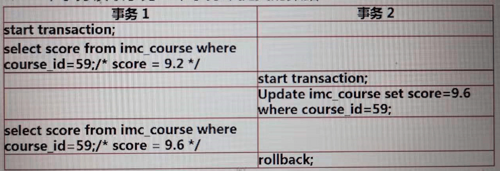
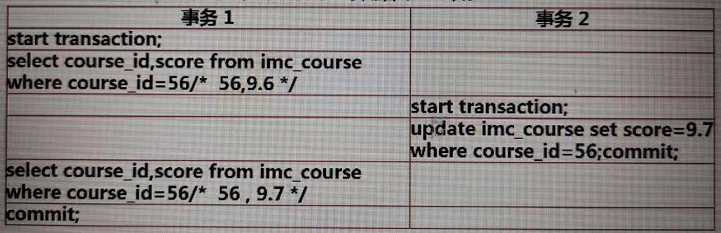

# 事务

## 什么是事务

- 数据库执行操作的最小逻辑单元
- 事务可以由一个SQL组成也可以由多个SQL组成

## 事务的特性

- 原子性(Atomicity) 一个事务中的所有操作，要么全部完成，要么全部不完成，不会结束在中间某个环节。事务的执行过程中可能会发生错误，那么会被回滚到事务开始之前的状态，
- 一致性(Consistency) 在事务开始之前和事务结束之后，数据库的完整性没有被破坏。这表示写入数据必须完全符合我们预设的一些规则，这包含数据的精确度，串联性，以及后续数据库可以自发的来完成的一些预定的工作。
- 隔离性(Isolation) 并发事务彼此隔离、独立，它不应该以任何方式依赖于其它事务，一个事务对数据的修改在该事务提交前对其他事务都不可见，```主要解决并发带来的问题```
- 持久性(Durability) 事务一旦提交，其结果就是永久性的，即便系统出现故障，也不会丢失对数据的修改，就算发生了宕机等事故，数据库也能将数据恢复

## 如何创建事务

- 开始事务 START TRANSACTION 或者 BEGIN
- 提交事务 COMMIT：事务提交后，会永久保存事务中对数据的修改
- 回滚或者说撤销事务 ROLLBACK：恢复到事务开始之前的状态

```javascript
START TRANSACTION / BEGIN

    //只能执行DML操作
    SELECT...
    UPDATE...
    INSERT...
    DELETE...

COMMIT / ROLLBACK

```

## 并发带来的问题

提高数据库的并发性，是为了提高数据库的数据处理效率，如果所有的事务都是按我们所设想的顺序来操作数据的，那么是不会出现问题。但是在存在并发的情况下，很难保证事务处理数据的顺序，那么事务按不受控制的顺序操作数据，就会出现```脏读```，```不可重复读```，```幻读```现象。

### 脏读

- 一个事务正在对一条记录做修改，在这个事务完成并提交前，这条记录的数据就处于不一致的状态；这时，另一个事务也来读取同一条记录，如果不加控制，第二个事务读取了这些脏数据，并据此作进一步的处理，就会产生未提交的数据依赖关系。这种现象被形象的叫做脏读。
- 一句话：事务A读取到了事务B已经修改但尚未提交的数据，还在这个数据基础上做了操作。此时，如果B事务回滚，A读取的数据无效，不符合一致性要求。
- 脏读是事务B里面修改了数据 ,这是不正常的
- 解决办法：如果在第一个事务提交前，任何其他事务不可读取其修改过的值，则可 以避免该问题。
  

### 不可重复读

- 一个事务在读取某些数据后的某个时间，再次读取以前读过的数据，却发现其读出的数据已经发生了改变、或某些记录已经被删除了！这种现象就叫做"不可重复读"
- 一句话：事务A读取到了事务B已经提交的修改数据，不符合隔离性,这是不正常的
- 解决办法：如果只有在修改事务完全提交之后才可以读取数据，则可以避免该问题
- 针对的是update或delete
  

### 幻读

- 一个事务按相同的查询条件重新读取以前检索过的数据，却发现其他事务插入了满足其查询条件的新数据，这种现象就称为"幻读"。
- 一句话：事务A读取到了事务B提交的新增数据，不符合隔离性
- 幻读是事务B里面新增了数据,这是不正常的
- 解决办法：如果在操作事务完成数据处理之前，任何其他事务都不可以添加新数据，则可避免该问题
- 针对的是 insert
  

## 事务的隔离性

解决并发带来的问题

### INNODB的隔离级别

对于同一个事务，在不同的事务隔离级别下，执行的结果是有可能不同的。隔离级别越高，那么数据的完整性，一致性也就越好，同时并发性也就越差。

|       隔离级别             |   脏读      |   不可重复读  |    幻读    |   隔离性    |   并发性   |
| ------------------------  | ------------| -------------| -----------| -----------| -----------|
|顺序读（SERIALIZABLE）      |     N       |       N      |      N     |    最高     |   最低     |
|可重复读（REPEATABLE READ） |     N       |       N      |      N     |             |           |
|读以提交（READ COMMITTED）  |     N       |       Y      |      Y     |             |            |
|读未提交（READ UNCOMMITTED）|     Y       |       Y      |      Y     |    最低     |   最高     |

顺序读（SERIALIZABLE）：强制对事务进行排序，使各个事务顺序执行，避免了各个事务之间的相互冲突，从而解决了脏读，不可重复读，幻读的问题。由于所有的事务都是顺序执行的，所以隔离性的级别是最高的，相应的并发性则是最差的事务隔离级别。当前级别下，事务是不存在并发执行的。

可重复读（REPEATABLE READ）：```INNODB默认的事务隔离级别```。可以保证在同一个事务中，多次读取同一个数据时，返回的结果是相同的。在SQL标准中可重复读可以避免脏读，不可重复读的问题，但是不能避免幻读的问题。不过在INNODB中利用了```Nextkey```（下一个键锁），这样一个机制，避免了在可重复读事务隔离级别下，产生幻读的问题。所以在INNODB中，可重复读事务隔离级别，不但可以做到顺序读的隔离性，同时事务的并发性也得到了保证。

读以提交（READ COMMITTED）：```SQLServer```，```PostGreSQL```中默认使用的隔离级别。保证了事务只能看到已经被提交的事务对关联数据的修改。只能避免脏读的问题，不能避免不可重复读，幻读的产生。因此，隔离性是比较差的，但是并发性确很高。

读未提交（READ UNCOMMITTED）：一个事务可以读到另一个事务未提交的数据，因此不能避免脏读，不可重复读，幻读的产生。这是一种隔离性最差的，但是并发性最高的事务隔离级别。

### 设置事务的隔离性

```javascript
//persist：持久化全局变量的修改方法，服务器重启后也不会失效
//global：意思是此语句将应用于之后的所有session，而当前已经存在的session不受影响。服务器重启后会失效
//session：意思是此语句将应用于当前session内之后的所有事务。
如果选择session，意思是此语句将应用于当前session内之后的所有事务
SET [PERSIST|GLOBAL|SESSION]
    TRANSACTION ISOLATION LEVEL
    {
       SERIALIZABLE
       | REPEATABLE READ
       | READ COMMITTED
       | READ UNCOMMITTED
    }
```

## 锁

- 计算机协调多个进程或线程并发访问某一资源的机制
- 为了在各个事务之间```实现隔离```，MySQL中引入了锁的概念，锁的主要作用是，保证一个事务不能对另外一个事务正在读取或修改的数据进行修改。

### INNODB中的锁

- 共享锁（读锁）：被加了共享锁的对象只能被持有锁的事务读取但不能修改，其他事务无法对该对象进行修改，但也可以对这个对象加共享锁，进行读取。```查询需要对被操作的资源加共享锁```。
- 排它锁（写锁）：被加了排它锁的对象只能被持有锁的事务读取和修改，其他事务无法对加了排它锁的对象进行读取和修改。```数据修改需要对被操作的资源加排它锁```。
- 排它锁与排它锁，排它锁与共享锁不兼容，不能同时加在相同的对象上。
- 共享锁与共享锁是兼容的。

|            |    共享锁   |    排它锁   |
| -----------| -----------|-----------  |
|   共享锁    |    兼容    |    不兼容    |
|   排它锁    |    不兼容  |   不兼容    |

### 阻塞和死锁

什么是阻塞？

- 由于不同锁之间的兼容关系，造成的一个事务需要等待另一个事务释放其所占用资源后，才能继续执行的现象
  - 在两个线程中，同时修改同一级数据时，线程2必须等待线程1，提交后或者回滚后继续执行，前面占有资源的线程执行缓慢，从而阻塞了后面线程的执行

如何发现阻塞？

```javascript
//从sys.innodb_lock_waits表中。获取阻塞时间大于10秒的数据信息
SELECT 
   waiting_pid AS '被阻塞的线程',
   waiting_query AS '被阻塞的SQL',
   blocking_pid AS '阻塞的线程',
   blocking_query AS '阻塞的SQL',
   wait_age AS '阻塞的时间',
   sql_kill_blocking_query AS '建议操作'
FROM sys.innodb_lock_waits
WHERE 
(UNIX_TIMESTAMP()-UNIX_TIMESTAMP(wait_started))>10
```

如何处理阻塞？

在实际工作中，阻塞是时常发生的，无法避免的。

- 终止占用资源的事务，使其释放资源，后续的事务就可以继续运行了（治标不治本）
  
  ```javascript
  //获取连接id
  SELECT CONNECTION_ID()
  //终止占用资源的连接
  KILL 8;//8：连接id
  ```

- 优化占用资源的SQL，使其尽快释放资源。减少占用资源的时间，避免长时间阻塞的产生。

什么是死锁？

- 并行执行的多个事务，相互之间占用了对方所需要的资源
  - MySQL内部会对死锁进行监控和处理，主动回滚多个事务中占用资源较少的事务，让其他的事务继续执行。

如何监控死锁

- 把死锁记录到MySQL的错误日志中
  
  ```javascript
  SET GLOBAL innodb_print_all_deadlocks = ON;
  ```

  如何处理死锁？

  - 数据库自行回滚占用资源少的事务（治标不治本）
  - 并发事务按照相同顺序占用资源，这样就把死锁转为阻塞，如果每个SQL都执行得非常快，只会阻塞很短的时间，不会影响到业务
  